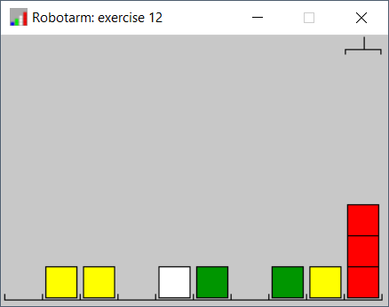

# Robotarm

Lees de instructies op de wiki pagina hoe de robotarm bibliotheek werkt. Vervolgens ga je proberen de onderstaande oefeningen te maken.

## Oefening 1
```python
from RobotArm import RobotArm

robotArm = RobotArm('exercise 1')

# Jouw python instructies zet je vanaf hier:
robotArm.moveRight()
robotArm.grab()
    
robotArm.moveLeft()
robotArm.drop()


# Na jouw code wachten tot het sluiten van de window:
robotArm.wait()
robotArm.moveRight()
Verplaats het rode blok één plek naar links.


## Oefening 2
```python
from RobotArm import RobotArm

robotArm = RobotArm('exercise 2')

# Jouw python instructies zet je vanaf hier:

robotArm.grab()
for y in range(9):
    robotArm.moveRight()
robotArm.drop()
for a in range(2):
    robotArm.moveLeft()
robotArm.grab()
for g in range(2):
    robotArm.moveRight()
robotArm.drop()
for left in range(5):
    robotArm.moveLeft()
robotArm.grab()
for g in range(5):
    robotArm.moveRight()
robotArm.drop()

# Na jouw code wachten tot het sluiten van de window:
robotArm.wait()
```
Stappel alle blokken op aan de rechterkant.


## Oefening 3
```python
from RobotArm import RobotArm

robotArm = RobotArm('exercise 3')

# Jouw python instructies zet je vanaf hier:

robotArm.moveRight()
robotArm.grab()
    
robotArm.moveRight()
robotArm.drop()

# Na jouw code wachten tot het sluiten van de window:
robotArm.wait()
```
Verplaats de hele stapel blokken één plek naar rechts.


## Oefening 4
```python
from RobotArm import RobotArm

robotArm = RobotArm('exercise 4')


# Jouw python instructies zet je vanaf hier:

robotArm.grab()
for y in range(6):
    robotArm.moveRight()
robotArm.drop()

# Na jouw code wachten tot het sluiten van de window:
robotArm.wait()
```
Verplaats de hele stapel blokken één plek naar rechts. Zorg ervoor dat de volgorde van de blokken gelijk blijft.


## Oefening 5
```python
from RobotArm import RobotArm

robotArm = RobotArm('exercise 5')

# Jouw python instructies zet je vanaf hier:

robotArm.grab()
for x in range (9):
    robotArm.moveRight()
robotArm.drop()
for f in range(2):
    robotArm.moveLeft()
robotArm.grab()
for y in range(2):
    robotArm.moveRight()
robotArm.drop()
for y in range(5):
    robotArm.moveLeft()
robotArm.grab()
for t in range(5):
    robotArm.moveRight()
robotArm.drop()
robotArm.grab()
robotArm.moveLeft()
robotArm.drop()
robotArm.moveRight()
robotArm.grab()
for y in range(2):
    robotArm.moveLeft()
robotArm.drop()


# Na jouw code wachten tot het sluiten van de window:
robotArm.wait()
```
Verplaats alle blokken één plek naar rechts. Zorg ervoor dat de volgorde van de blokken gelijk blijft. 


## Oefening 6
```python
from RobotArm import RobotArm

robotArm = RobotArm('exercise 6')

# Jouw python instructies zet je vanaf hier:

robotArm.grab()
for a in range(9):
    robotArm.moveRight()
robotArm.drop()
for a in range(2):
    robotArm.moveLeft()
robotArm.grab()
for x in range(2):
    robotArm.moveRight()
robotArm.drop()
for f in range(5):
    robotArm.moveLeft()
robotArm.grab()
for f in range(5):
    robotArm.moveRight()
robotArm.drop()
robotArm.grab()
robotArm.moveLeft()
robotArm.drop()
robotArm.moveRight()
robotArm.grab()
    for c in range(2):
robotArm.moveLeft()
robotArm.drop()


# Na jouw code wachten tot het sluiten van de window:
robotArm.wait()
```
Verdeel de rode en witte blokken over 2 stapels: een rode stapel en een witte stapel. 


## Oefening 7
```python
from RobotArm import RobotArm

robotArm = RobotArm('exercise 7')

# Jouw python instructies zet je vanaf hier:

for a in range(6):
    robotArm.moveRight()
    robotArm.grab()
    robotArm.moveLeft()
    robotArm.drop()
    robotArm.moveRight(2)
    
for b in range(6):
    robotArm.moveRight()
    robotArm.grab()
    robotArm.moveLeft()
    robotArm.drop()

# Na jouw code wachten tot het sluiten van de window:
robotArm.wait()
```
Verplaats iedere stapel één plek naar links.

Je mag maximaal 11 regels code gebruiken inclusief de import, het laden van de robotarm en de wait


## Oefening 8
```python
from RobotArm import RobotArm

robotArm = RobotArm('exercise 8')

# Jouw python instructies zet je vanaf hier:
for a in range(7):
    robotArm.moveRight()
    robotArm.grab()
    robotArm.moveLeft()
    robotArm.drop()


# Na jouw code wachten tot het sluiten van de window:
robotArm.wait()
```
Verplaats de stapel naar de rechterkant.

Je mag maximaal 11 regels code gebruiken inclusief de import, het laden van de robotarm en de wait


## Oefening 9
```python
from RobotArm import RobotArm

robotArm = RobotArm('exercise 9')

# Jouw python instructies zet je vanaf hier:
teller = 1
for i in range(0,4):
    for i in range(0, teller):
        robotArm.grab()
        for i in range(0,4): robotArm.moveRight()
        robotArm.drop()
        for i in range(0,4): robotArm.moveLeft()
    robotArm.moveRight()
    teller += 1
robotArm.wait()

# Na jouw code wachten tot het sluiten van de window:
robotArm.wait()
```
Verplaats alle stapels vijf stappen naar rechts.

Je mag maximaal 12 regels code gebruiken inclusief de import, het laden van de robotarm en de wait


## Oefening 10
```python
from RobotArm import RobotArm

robotArm = RobotArm('exercise 10')

# Jouw python instructies zet je vanaf hier:


# Na jouw code wachten tot het sluiten van de window:
robotArm.wait()
```
Draai de volgorde van de blokken om.

Je mag maximaal 15 regels code gebruiken inclusief de import, het laden van de robotarm en de wait


## Oefening 11
```python
from RobotArm import RobotArm

robotArm = RobotArm('exercise 11')

# Jouw python instructies zet je vanaf hier:


# Na jouw code wachten tot het sluiten van de window:
robotArm.wait()
```
Verplaats alle witte blokken één plek naar rechts. 

Let op, de blokken zijn iedere keer anders als je het programma start!


## Oefening 12
```python
from RobotArm import RobotArm

robotArm = RobotArm('exercise 12')

# Jouw python instructies zet je vanaf hier:


# Na jouw code wachten tot het sluiten van de window:
robotArm.wait()
```
Verplaats alle rode blokken naar het einde.

Let op, de blokken zijn iedere keer anders als je het programma start!



## Oefening 13
```python
from RobotArm import RobotArm
# Let op: hier start het anders voor een random level:
robotArm = RobotArm()
robotArm.randomLevel(1,7)

# Jouw python instructies zet je vanaf hier:


# Na jouw code wachten tot het sluiten van de window:
robotArm.wait()
```
Verdeel alle blokken over de lege plaatsen, zodra er geen blokken meer zijn moet de arm stoppen.


resultaat na verdeling ziet er zo uit:


## Bonusopdrachten
### Spreiding
Verspreid de blokken van de stapel. Gebruik level: exercise 3.


naar:


### Soorten
Verzamel de kleuren in stapels. Gebruiken level: soorten


naar:


### Democratie
Tel alle kleuren. Maak een stapel van de meestgetelde kleur. Gebruik level: democratie


meest getelde kleur naar één stapel:


Zijn er meerdere kleuren het meest geteld, kies dan zelf welke kleur je opstapelt:


naar:


Veel puzzelplezier en succes!

### Kantelen
Kantel de kleuren in de stapels. Gebruik level: exercise 9.


naar:


